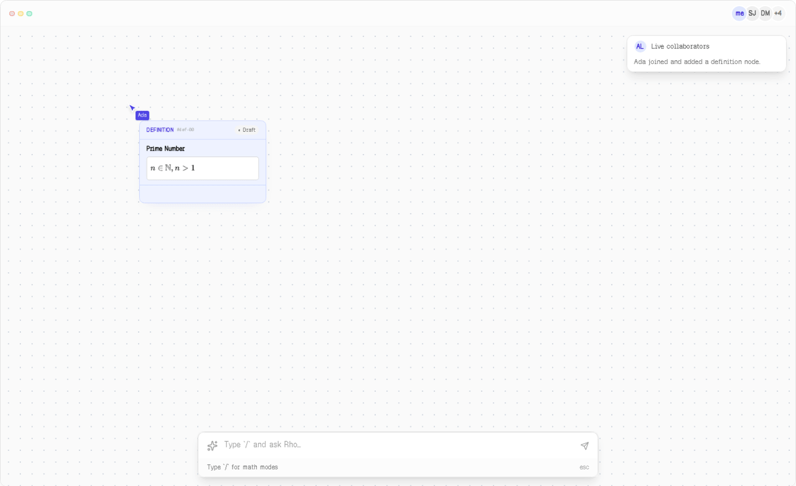
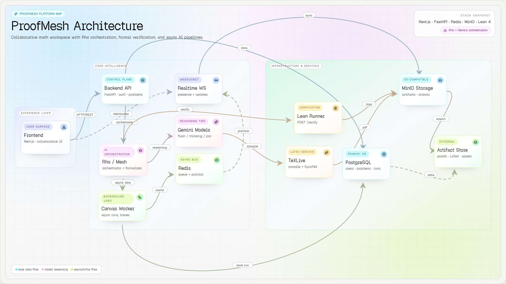

# ProofMesh: The Collaborative Graph for Formal Mathematics

---

> *If it compiles, it collaborates.*

---

## Inspiration 💡

Proofs are not documents. They are dependency graphs.

A definition feeds a lemma, a lemma supports a theorem, a counterexample kills a claim, a revision restarts a branch. That structure exists in every mathematician's head — but no tool actually represents it.

Mathematical collaboration today is fragmented in a way that feels almost absurd given the tools we have for everything else. Writing happens in Overleaf. Verification happens in a Lean 4 terminal. Discussion happens in email threads, Slack channels, and scribbled margins. The proof itself — the actual logical object — lives nowhere as a coherent, shared artifact.

We kept coming back to one concrete scenario. A mathematician in Buenos Aires sketches a claim. Someone in Tokyo tries to break it. The proof still needs to compile in Lean 4. Right now, that workflow requires at least four different tools and a lot of copy-pasting. Context is lost at every handoff. Structure is invisible. Verification is an afterthought bolted on at the end.

This problem is growing beyond academia. Formal verification is expanding into smart contracts, critical infrastructure, and AI safety — domains where correctness is non-negotiable. Yet the tooling for collaborative formal work hasn't kept pace with the expanding demand. Teams working on formally verified systems face the same fragmentation: draft in one place, verify in another, discuss in a third, and hope nothing gets lost between them.

ProofMesh was built to close that gap. One shared workspace for the entire loop:

**Idea → draft → argument → Lean code → fix → verified.**

---

## What it does 🪄

ProofMesh is a unified workspace that bridges the gap between informal mathematical drafting and formal verification. Instead of scattering proof work across disconnected tools, it brings the entire lifecycle into a single, visual, collaborative environment.

### 1. The Canvas

Proofs live as visual dependency graphs, not linear documents. Every node in the graph is a typed artifact: **Definition**, **Claim**, **Lemma**, **Theorem**, **Counterexample**, **Formal Test**, **Computation**, or **Note**. Each artifact carries explicit status, dependencies, and a verification path. Dependencies are edges in the graph — visible and structural — not assumptions buried in prose.

This means the logical architecture of a proof is always visible. You can see what depends on what, what's verified, what's still a conjecture, and where the weak points are. When something breaks, the graph shows you the blast radius.

### 2. Rho — The AI Layer

Rho is a multi-agent system powered by **Gemini 3** with four specialized roles, each tuned for a distinct part of the proof workflow:

- **Explorer** — Generates conjectures, finds connections between artifacts, brainstorms proof approaches. Runs at high temperature (0.9) with generous token budgets to maximize creative coverage.
- **Formalizer** — Translates informal LaTeX into Lean 4 code using Gemini 3 Flash's **Thinking Mode** for deep reasoning chains. This is the core formalization engine, optimized for strict syntax compliance and type-theoretic correctness.
- **Critic** — An adversarial agent that tries to break claims, find counterexamples, and stress-test logical steps. The Critic is not there to be polite; it exists to find the failure mode before the compiler does.
- **LaTeX Assistant** — Performs surgical edits to equations and proofs via structured tool use, modifying specific expressions rather than regenerating entire documents.

Each agent operates with task-specific temperatures (0.0 for deterministic scoring, 0.9 for creative ideation) and explicit token budgets. The roles mirror real mathematical collaboration: propose, formalize, attempt to break, refine.

### 3. First-Class Verification

The gap between "looks mathematically sound" and "compiles in Lean" is where most time is lost in formal mathematics. ProofMesh bridges this with **one-click verification** via an isolated Lean runner.

The Lean compiler is not an afterthought — it's the arbiter of truth. Errors return as structured output that feeds back into the graph, marking exactly where verification failed and why. The system supports iterative correction: fail, read the error, fix, re-verify. This loop is the product's heartbeat.

### 4. Writing Lab

A LaTeX drafting environment with AI-assisted editing, **KaTeX** rendering for real-time math preview, and **Monaco editor** integration for a professional editing experience. The Writing Lab connects directly to the canvas — drafts become artifacts, artifacts get formalized, and the whole chain stays linked.

### 5. Knowledge Library

Every artifact in ProofMesh is stored in a typed knowledge library where definitions, lemmas, and theorems can be searched, reused, and referenced across projects. Semantic search powered by **gemini-embedding-001** matches mathematical concepts by meaning rather than keyword — so searching for "bounded sequence" surfaces results about convergence, compactness, and related structures.

### 6. Social Layer

ProofMesh ships with collaboration primitives from day one: activity feed, threaded discussions, teams, follows, stars, notifications, mentions, and trending views. Because proving things together is a social activity as much as it is a technical one. The social layer is not bolted on — it's woven into the canvas, the library, and the verification workflow.

---

## How we built it 🛠️

ProofMesh runs as a multi-service stack in **Docker Compose**: Next.js 16 frontend, FastAPI backend, Postgres, Redis, MinIO, a Lean 4 runner, a TexLive compiler, and a canvas AI worker.

### Gemini 3 as the Engine (not a chatbot)

We integrated Gemini 3 not as a generic assistant but as the **reasoning engine** powering our Rho agent system. Three Gemini capabilities are load-bearing parts of the product — not interchangeable with another provider:

#### Gemini 3 Flash with Thinking Mode — The Formalizer

This is the single biggest technical differentiator in ProofMesh.

We use `gemini-3-flash-preview` with task-specific thinking levels and token budgets for the **Formalizer Agent**. Translating informal LaTeX into formal Lean 4 code is not a translation task — it's a reasoning task. The model needs to plan the formalization strategy, map mathematical concepts to Lean's dependent type system, resolve implicit assumptions, and respect strict syntax rules.

**Thinking Mode** enables exactly this planning step. Instead of generating Lean code in a single shot (which produces plausible but broken output), the model reasons through the formalization in stages: identify the mathematical structure, determine the appropriate Lean tactics, plan the proof term, and then generate code. This drastically reduces compilation errors compared to zero-shot generation.

The result: **Thinking Mode turns "hallucinated proofs" into "verified code."**

#### Two-Tier Model Strategy

Not every task needs deep reasoning. We run a deliberate two-tier strategy:

- **Gemini 3 Flash** handles high-throughput tasks: exploration, LaTeX assistance, idea fusion, pattern scoring. Temperature 0.9, higher token budgets. Fast and creative.
- **Gemini 3 Pro** handles reasoning-heavy work: formalizing into Lean 4, critiquing proof proposals, multi-step canvas workflows. Temperature 0.0, strict budgets. Precise and deterministic.

This split keeps costs predictable while ensuring the right model handles the right task.

#### Tool Use & Streaming

Two capabilities that transform the user experience:

- **Tool Use**: The LaTeX chat agent calls a structured `updateDocument` function to apply precise, targeted edits instead of regenerating entire documents. When you ask the AI to fix an equation, it modifies that equation — not the surrounding three paragraphs. Surgical, not destructive.
- **Streaming**: Canvas agents push partial output to the UI in real time via the **Vercel AI SDK** (`@ai-sdk/google`). When the Formalizer is working through a multi-step proof, you see it think. That transforms the UX from "waiting for a black box" to "watching a collaborator work." This is critical for trust — users need to see reasoning unfold, not just receive final answers.

### Lean Verification Runtime

The Lean runner is an isolated `lean-runner` service exposed through `POST /verify`. It writes a temporary `.lean` file, runs `lake env lean`, returns structured output (pass/fail with full error traces), and cleans up. Dependencies are cached via a mounted `.lake` volume so iteration speed stays usable — you don't wait five minutes for a basic proof to compile.

The toolchain is pinned via `mesh/mesh_project/lean-toolchain`, and the runner includes cache and repair logic to handle Mathlib dependency edge cases. This is not a toy demo. It handles real Mathlib dependencies at real iteration speed.

### Orchestration Architecture

Canvas AI runs are persisted and queued in **Redis**, processed by the `canvas-ai-worker`, and streamed back through **Redis Pub/Sub** plus **WebSocket** endpoints. The orchestrator in `mesh/backend/orchestrator.py` stays **deterministic**: explicit Python control flow, not an LLM deciding when to call other LLMs.

This is a deliberate architectural decision. Agentic loops where models decide when to invoke other models lead to unpredictable behavior and unpredictable costs. Our orchestrator delegates model calls and verification steps through explicit code paths. The system does what you expect it to do, every time.

### Architecture Overview

---

## Challenges we ran into 🎯

### 1. The "Looks Right, Fails to Compile" Paradox

LLMs generate plausible mathematical reasoning that fails formal verification. This is not a bug in the model — it's a fundamental property of formal languages. Natural language tolerates ambiguity; Lean's type checker does not.

We solved this by making the Lean compiler an explicit step in the feedback loop, following a **Reflexion pattern**: errors are structured, returned to the agent, and the system iterates toward compilation rather than hoping for a correct first shot. The key insight is that verification failure is not a dead end — it's information. The error trace tells the Formalizer exactly what went wrong and where.

### 2. Lean Toolchain Stability

Toolchain compatibility and Mathlib dependency state matter more than we expected. Lean 4 and Mathlib are actively evolving, and version mismatches produce cryptic build failures that have nothing to do with the proof itself. Managing this in a multi-tenant environment was complex.

We built a custom caching layer: pinned toolchain via `lean-toolchain`, mounted `.lake` volumes with warm Mathlib caches, and repair logic in the runner path. A flaky toolchain makes the entire verification promise meaningless, so we invested significant engineering time here. Users should never wait five minutes because a dependency cache was cold.

### 3. Keeping Collaboration Responsive While Jobs Run

Lean compilation is not instant. A moderately complex proof with Mathlib imports can take seconds to minutes. Nobody wants to stare at a spinner while a theorem compiles.

We needed queue-based execution via Redis, persistent state tracking, event streaming through WebSockets, and optimistic UI updates. The frontend shows progress and allows users to continue working on other parts of the graph while verification runs in the background. Responsiveness is not optional — it's what makes the tool feel like a workspace instead of a batch processor.

### 4. Frontend Integration Complexity

Monaco editor, KaTeX rendering, PDF.js, mentions, drag-and-drop graph manipulation, and AI streaming workflows all had to coexist in one coherent workspace. Each of these is a substantial library with its own opinions about DOM management, state, and event handling.

Getting them to play nicely together — especially with real-time streaming updates from multiple concurrent AI agents — took more engineering than the individual features. The integration work is invisible to users, which is exactly the point.

### 5. Agent Coordination Without Chaos

The temptation was to let agents call agents. We resisted.

The orchestrator uses explicit Python control flow with delegated model calls and delegated verification. No agentic loops deciding when to invoke models. No recursive agent chains. The system is debuggable, reproducible, and costs are predictable. We've seen projects where autonomous agent loops produce impressive demos and terrifying AWS bills. We chose reliability over autonomy.

---

## Accomplishments that we're proud of ✨

**Thinking Mode as a Formalization Breakthrough.** We demonstrated that enabling Gemini's Thinking Mode is a game-changer for formal language generation. For Lean 4, where syntax is unforgiving and type theory is strict, the reasoning chain that Thinking Mode enables turns "plausible but broken" output into "verified and compiling" code. This is our strongest technical validation and the clearest evidence that Gemini 3's capabilities directly enable a product that wouldn't work otherwise.

**One workspace, not four tools.** Informal ideas, structured discussion, and formal verification live together. That sentence sounds simple, but it took real architectural work to make the canvas, the editor, the library, and the Lean runner feel like one product instead of four features sharing a URL. The graph is the unifying abstraction — everything connects through it.

**The verification loop is real.** You can go from "I think this is true" to "Lean says this compiles" without leaving the canvas. The Lean runner behind a simple HTTP interface with dependency caching gives a clear, repeatable verification step at usable iteration speed. This is not a simulated demo — it runs real Lean 4 with real Mathlib.

**Deterministic orchestration.** No agentic loops, no surprise API costs, no "the model decided to call itself twelve times" scenarios. Explicit control flow with delegated model calls. The system does what you expect it to do, and the bill matches what you expected to pay.

**Social primitives as core product.** Mentions, discussions, notifications, teams, and activity tracking are first class because proving things together is a social activity, not a solo performance. We built the social layer from day one rather than promising to add it later, because collaboration that isn't built into the architecture is collaboration that doesn't actually happen.

---

## What we learned ✍️

**Formal verification is binary — and that's the point.** Lean 4 enforces exactness. Something can look perfectly reasonable in LaTeX and still fail to type-check. That gap between informal reasoning and formal code is exactly where AI-assisted formalization adds the most value, and exactly where Thinking Mode proves its worth. The compiler doesn't care how elegant your argument is. It cares whether it compiles.

**Specialized agents beat general assistants.** Splitting responsibilities into Explorer, Formalizer, Critic, and LaTeX Assistant makes each interaction more focused and the outputs more useful. A critic that's told to break things finds real issues. A formalizer that's told to compile finds real syntax. A general-purpose chatbot does neither well.

**The orchestrator must stay deterministic.** Letting a model decide when to call other models leads to loops and costs that are hard to predict or debug. Explicit control flow keeps the system reliable, the behavior reproducible, and the bills predictable. This is an engineering discipline, not a limitation.

**Math tooling is technical rigor plus human coordination.** Proving work needs discussion threads, feedback loops, teams, and visibility into who contributed what. The social layer cannot be separated from the technical layer — they're the same product. We had to build both as core architecture, not treat one as an afterthought to the other.

**Proof formalization is a meaning-driven problem.** Just as mapping spreadsheets to project management structures requires understanding intent (not just parsing cells), formalizing mathematics requires understanding the mathematical meaning behind notation. The structure exists in the mathematician's head. The tool's job is to make it visible, shareable, and verifiable.

---

## What's next for ProofMesh 🚀

**Semantic library search.** Deep integration with `gemini-embedding-001` to suggest relevant existing lemmas from the Mathlib library as you build your graph. When you define a claim, ProofMesh surfaces related results — definitions, prior proofs, known counterexamples — automatically from both your workspace and the broader Mathlib ecosystem.

**Auto-formalization loops.** Fully autonomous loops where Gemini iteratively fixes code based on compiler feedback until verification passes. The Reflexion pattern taken to its logical conclusion: draft, compile, read errors, fix, recompile — with human oversight at configurable checkpoints rather than at every step.

**Multi-file and multi-proof workspaces.** Extend support beyond single proof graphs to interconnected proof libraries where theorems from one project feed into another. Real mathematical work doesn't happen in isolation — results build on results.

**Stronger social-context ranking.** So discussions and feed activity stay mathematically useful as usage grows, surfacing the most relevant conversations and contributions rather than just the most recent ones.

**Beyond mathematics.** The same graph-based verification architecture applies to **smart contract verification**, **critical infrastructure code**, and any domain where correctness is non-negotiable and collaboration is required. ProofMesh's architecture is a blueprint for collaboration around correctness — not just collaboration around text. If the structure is a dependency graph and the arbiter is a compiler, the pattern generalizes.

---

*If it compiles, it collaborates.*